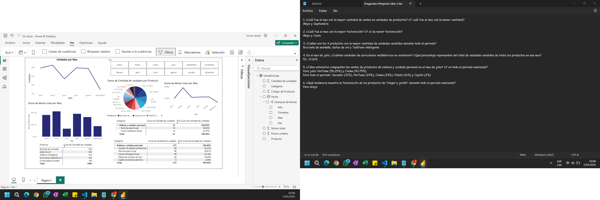
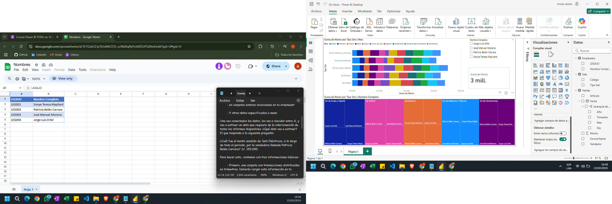

### Introducción a Power BI

### Crea Visualizaciones Avanzadas con Power BI
    ✅ Tablas, Matrices y Tarjetas
    ✅ Formato Condicional
    ✅ Diagrama de Árbol y Gráfico de Cintas

### Integración de Datos en Power BI
    ✅ Usos de Parámetros
    ✅ Conexión a Carpetas, la Web y Hojas de Cálculo
    ✅ Documentación de Conexión a todas las Fuentes de Datos

