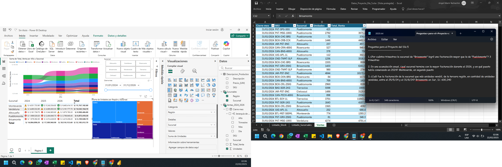
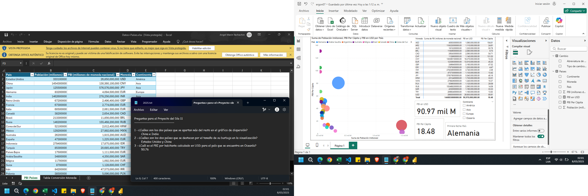

### Introducción a Power BI

### Crea Visualizaciones Avanzadas con Power BI
    ✅ Tablas, Matrices y Tarjetas
    ✅ Formato Condicional
    ✅ Diagrama de Árbol y Gráfico de Cintas

### Integración de Datos en Power BI
    ✅ Usos de Parámetros
    ✅ Conexión a Carpetas, la Web y Hojas de Cálculo
    ✅ Documentación de Conexión a todas las Fuentes de Datos

### Devela el Poder de Power Query
    ✅ Análisis Exploratorio de Datos
    ✅ Limpieza y Calidad de Datos
    ✅ Transformación de Texto, Números y Tiempo
    

### Domina Power Query para Power BI
    ✅ Cambio de Configuración Regional
    ✅ Combinar y Anexar Consultas
    ✅ Dinamización de Columnas

### Primeros Pasos con DAX
    ✅ Sintaxis de Medidas en DAX
    ✅ Tipos de Cálculos en DAX
    ✅ Funciones Básicas en DAX

### DAX Avanzado Hecho Fácil
    ✅ Variables y Contextos en DAX
    ✅ Función CALCULATE y Medidas Rápidas
    ✅ Agrupar Medidas en una Tabla Dedicada

